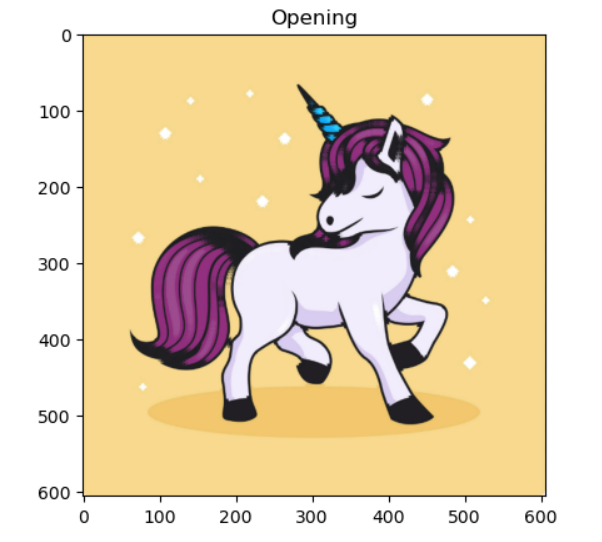
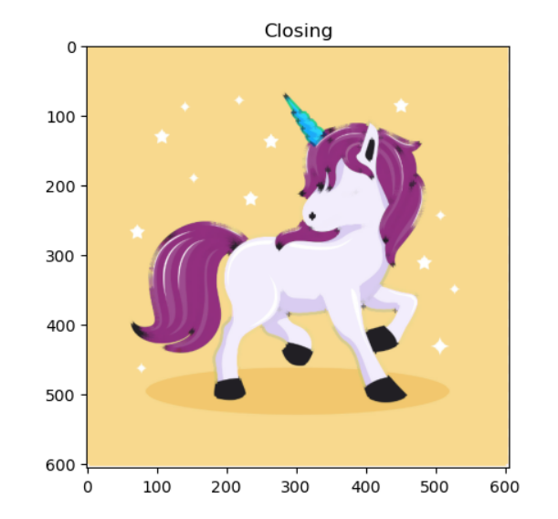

# Opening-and-Closing

## Aim
To implement Opening and Closing using Python and OpenCV.

## Software Required
1. Anaconda - Python 3.7
2. OpenCV
## Algorithm:
### Step1:
Import the necessary packages.
### Step2:
Create the text image using cv2.putText.
### Step3:
Then create the structuring element for opening and closing.
### Step4:
Apply erosion and dilation using cv2.MORPH_OPEN and cv2.MORPH_CLOSE.
### Step5:
Plot the images using plt.imshow.
## Program:
~~~
DEVELOPED BY : Meiyarasi.V
REGISTER NUMBER : 212221230058
~~~
``` Python
# Import the necessary packages
import cv2
import numpy as np
import matplotlib.pyplot as plt

# Display the Original image
input_img = cv2.imread('uc.png')
plt.imshow(input_img)
plt.axis('off')
# Create the structuring element

kernel = cv2.getStructuringElement(cv2.MORPH_CROSS,(7,7))

# Use Opening operation

image_mei = cv2.morphologyEx(input_img,cv2.MORPH_OPEN,kernel_mei)
plt.title("Opening")
plt.imshow(image_mei,'magma')
plt.axis('on')

# Use Closing Operation

image_mei1 = cv2.morphologyEx(input_img,cv2.MORPH_CLOSE,kernel1)
plt.title("Closing")
plt.imshow(image_mei1,'magma')
plt.axis('on')

```
## Output:

### Display the input Image


### Display the result of Opening



### Display the result of Closing



## Result
Thus the Opening and Closing operation is used in the image using python and OpenCV.